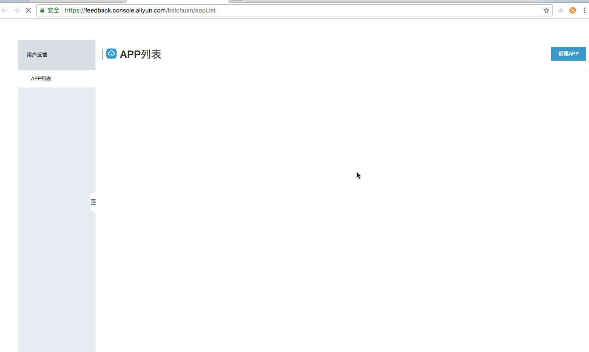

# 阿里云移动用户反馈Demo APP Android版

移动用户反馈（Mobile Feedback）是App内部的用户反馈系统。无需退出，就可以快速发送文字、图片、语音进行意见反馈和报告Bug。 开发者可以及时和用户保持沟通，提升用户满意度（此外，自动抓取APP在应用市场的评论数据，帮助开发者掌握用户对应用的评论）。


## 产品特性

-   反馈管理——查看用户的反馈，打标签，回复用户，还可按照用户、关键字、系统、状态、版本等搜索反馈内容。
-   客户端UI自定义——开发者可以自定义反馈的界面风格，所有更改都能即时在客户端界面预览到效果。
-   标签管理——可以自定义二级标签，配置根据关键字自动打标签，批量打标签、手动给用户打标签，按标签搜索反馈。
-   市场评论——自动抓取开发者APP在应用市场的评论数据，帮助开发者及时掌握用户对应用的评论。
-   快速集成——无需费力编写大量代码，就可快速轻松的集成用户反馈SDK。


## 使用方法

### 1 创建APP

您首先需要登入移动用户反馈控制台，创建一个APP实体以对应您准备使用的Demo APP。关于APP创建的指引文档可以参考：

>[创建App](https://help.aliyun.com/document_detail/53142.html)


### 2. 下载Demo工程

将工程克隆或下载到本地：

```shell
git clone https://github.com/aliyun/alicloud-android-demo.git
```

其中`feedback_android_demo`即为移动用户反馈的Demo APP。

feedback_android_demo已经完成了移动用户反馈SDK的集成工作，但我们还是建议您仔细阅读移动用户反馈的集成文档

>[Android SDK配置文档](https://help.aliyun.com/document_detail/53144.html)

**当您在使用您自己的APP集成移动用户反馈遇到问题时，您可以对比下demo APP的配置情况。**

###  3. 配置APP信息

#### 3.1 配置AppKey、AppSecret

为了使Demo APP能够正常运行，您还需要配置您的 AppKey / AppSecret 信息。您可以在移动用户反馈控制台，您在第一步创建的APP中找到它们。

>[如何获取您的 AppKey / AppSecret](https://help.aliyun.com/document_detail/436513.html?spm=a2c4g.11186623.0.0.613342899Kvoah#aa691d4160wc4)

在FeedbackAPI.init时传入：

```java
FeedbackAPI.init(application, appkey, appSecret);
```


### 4. 运行程序

若程序编译通过，且运行时可以打开用户反馈的界面提交反馈说明集成成功。

### 5. 动态展示




## 联系我们

-   官网：[移动用户反馈](https://www.aliyun.com/product/feedback)

