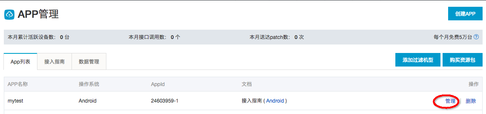

# 阿里云移动热修复Demo APP Android版
[](https://mhub.console.aliyun.com/#/download) [](https://developer.android.com/index.html) [](http://www.oracle.com/technetwork/java/index.html) [](https://www.aliyun.com/product/hotfix)


<div align="center">

</div>

移动热修复（Mobile Hotfix）是面向移动开发者的App热修复服务方案。产品基于阿里巴巴首创hotpatch技术，提供细粒度热修复能力，无需等待，实时修复应用线上问题。

## 产品特性

-   快速修复——实时修复应用线上问题，无需发版，无需等待用户更新。
-   接入简单——两行代码即可接入，对应用无侵入，自由发布，最大化保证用户体验。
-   增量补丁——补丁包采用差量技术，Patch体积小，对应用无侵入，几乎无性能损耗。
-   安全稳定——Patch本地加密，文件存储安全无忧，对称与非对称加密结合，稳定可靠。


## 使用方法

### 1 创建APP

您首先需要登入移动热修复控制台，创建一个APP实体以对应您准备使用的Demo APP。关于APP创建的指引文档可以参考：

>[创建App](https://help.aliyun.com/document_detail/53238.html)

### 2. 下载Demo工程

将工程克隆或下载到本地：

```shell
git clone https://github.com/aliyun/alicloud-android-demo.git
```

并通过Android Studio加载后您可以看到如下目录：


其中`hotfix_android_demo`即为移动热修复的Demo APP。

hotfix_android_demo已经完成了移动热修复SDK的集成工作，但我们还是建议您仔细阅读移动热修复的集成文档

>[Android SDK配置文档](https://help.aliyun.com/document_detail/53240.html)

**当您在使用您自己的APP集成移动热修复遇到问题时，您可以对比下demo APP的配置情况。**

###  3. 配置APP信息

#### 3.1 配置IDSECRET、APPSECRET、RSASECRET

为了使Demo APP能够正常运行，您还需要配置您的IDSECRET/APPSECRET/RSASECRET信息。您可以在移动热修复控制台，您在第一步创建的APP中找到它们，如图所示：



在下述`AndroidManifest.xml`代码片段中用您的AppId/AppSecret/RSA密钥替换`********`字段占据的参数。

```xml
        <meta-data
            android:name="com.taobao.android.hotfix.IDSECRET"
            android:value="********" />
        <meta-data
            android:name="com.taobao.android.hotfix.APPSECRET"
            android:value="********" />
        <meta-data
            android:name="com.taobao.android.hotfix.RSASECRET"
            android:value="********" />
```


### 4. 运行程序

若程序编译通过，且运行时SophixManager.getInstance().initialize()打印出类似如下日志，则说明集成成功：

```
08-30 15:37:51.183 18654-18654/? D/Sophix.SophixManager:  initialize time consumed(ms): 6
```


### 5. 动态展示


## 联系我们

-   官网：[移动热修复](https://www.aliyun.com/product/hotfix)
-   钉钉技术支持：11711603（钉钉群号）
-   官方技术博客：[阿里云移动服务](https://yq.aliyun.com/teams/32)

