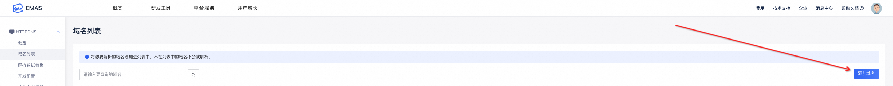
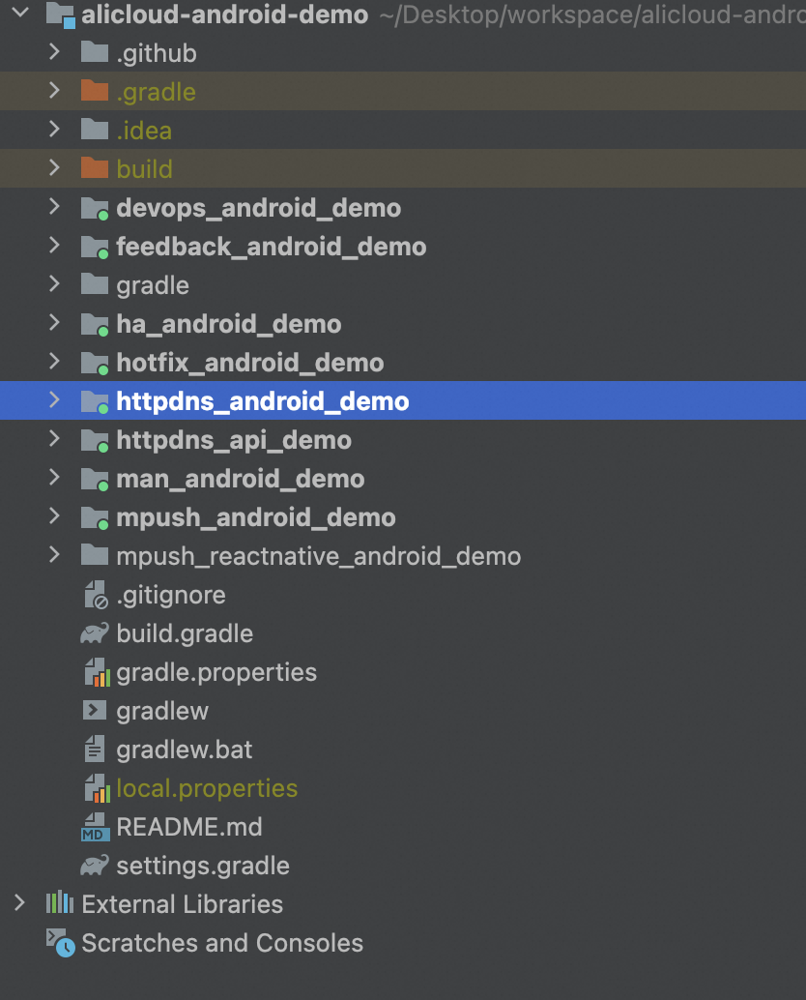
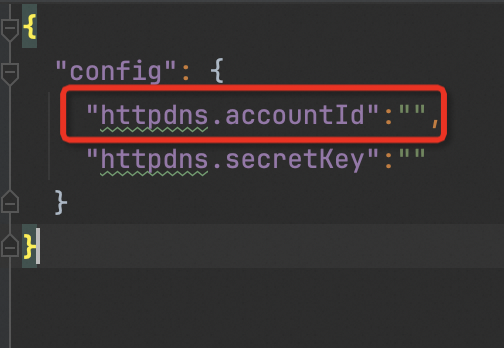

# 阿里云HttpDns Demo APP Android版
[](https://mhub.console.aliyun.com/#/download) [](https://developer.android.com/index.html) [](http://www.oracle.com/technetwork/java/index.html) [](https://www.aliyun.com/product/httpdns)


<div align="center">

</div>

HTTPDNS使用HTTP协议进行域名解析，代替现有基于UDP的DNS协议，域名解析请求直接发送到阿里云的HTTPDNS服务器，从而绕过运营商的Local DNS，能够避免Local DNS造成的域名劫持问题和调度不精准问题。

## 产品特性

-   *防劫持*——绕过运营商Local DNS，避免域名劫持，让每一次访问都畅通无阻。
-   *精准调度*——基于访问的来源IP，获得最精准的解析结果，让客户端就近接入业务节点。
-   *0ms解析延迟*——通过热点域名预解析、缓存DNS解析结果、解析结果懒更新策略等方式实现0解析延迟。
-   *快速生效*——避免Local DNS不遵循权威TTL，解析结果长时间无法更新的问题。
-   *降低解析失败率*——有效降低无线场景下解析失败的比率。
-   *稳定可靠*——99.9%的可用性，确保域名解析服务稳定可靠。


## 使用方法

### 1 创建APP

您首先需要登入移动推送控制台，创建一个APP实体以对应您准备使用的Demo APP。关于APP创建的指引文档可以参考：

>[创建项目和App](https://help.aliyun.com/document_detail/436513.html?spm=a2c4g.434660.0.0.255d4289JUbMoM#section-8am-xwe-iqh)


### 2. 控制台添加域名

HTTPDNS控制台：[链接](https://emas.console.aliyun.com/emasService/platformService/httpdns/domain)


<div align="center">

</div>

点击`添加域名`完成域名添加

控制台上添加的域名，1分钟后会在HTTPDNS服务端生效。


### 3. 下载Demo工程

将工程克隆或下载到本地：

```shell
git clone https://github.com/aliyun/alicloud-android-demo.git
```

并通过Android Studio加载后您可以看到如下目录：

<div align="center">

</div>

其中`httpdns_android_demo`即为HttpDns的Demo APP。

httpdns_android_demo已经完成了HttpDns SDK的集成工作，但我们还是建议您仔细阅读HttpDns的集成文档

>[Android SDK配置文档](https://help.aliyun.com/document_detail/435250.html)

**当您在使用您自己的APP集成HttpDns遇到问题时，您可以对比下demo APP的配置情况。**

###  3. 配置APP信息

HttpDns Demo可以直接运行，体验相关功能。同时您也可以把相关参数改成您自己的参数，再体验相关功能。

#### 3.1 配置accountID

将`aliyun-emas-services.json`文件中的`httpdns.accountId`设置成您自己的accountID：

<div align="center">

</div>


### 4. 运行程序

运行程序，程序启动后，在输入框输入您在控制台配置的域名，点击`开始解析`按钮，如果解析结果不为空，则说明解析成功：


## 联系我们

-   官网：[HTTPDNS](https://www.aliyun.com/product/httpdns)
-   钉钉技术支持：11777313（钉钉群号）
-   官方技术博客：[阿里云移动服务](https://yq.aliyun.com/teams/32)
